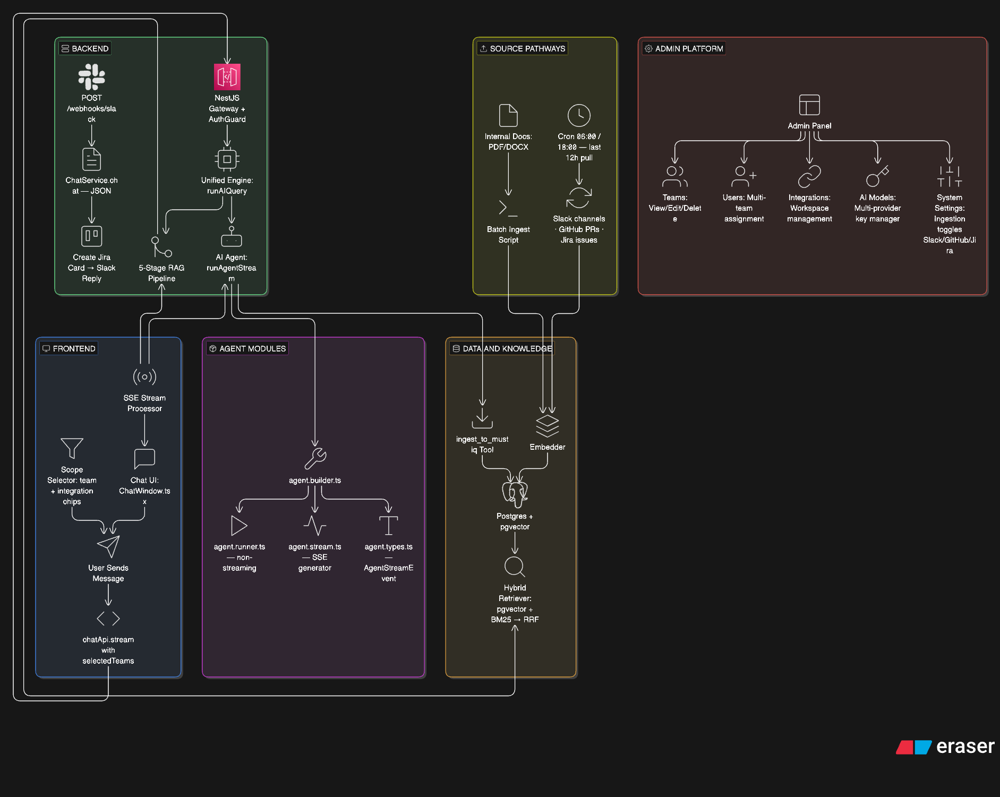

# Must-IQ: Full-Stack AI Flow



The interaction between the user interface, the backend, and the AI ingestion process follows a structured **RAG (Retrieval-Augmented Generation)** architecture. This ensures a seamless, streaming chat experience backed by internal company knowledge, scoped to the user's **assigned teams and their associated workspaces**. Jira workspaces are uniquely shareable across multiple teams.

## Frontend Flow (Interacting)

1. **Team/Scope Selection**: The user picks which team's integration sources (Jira · GitHub · Slack) to include in the search, using the sidebar **Scope Selector**. `General` is always locked ON.
2. **Submission**: User types a question in `InputBar.tsx` and hits send. The selected team IDs are included in the request payload.
3. **Streaming Request**: `chatApi.stream` initiates a `POST` to the backend with `stream: true` and `selectedTeams`. Native `fetch` is used (not Axios) because it supports browser-side SSE streaming.
4. **Real-time Processing**: As the backend generates tokens, the frontend reads the body stream using a `ReadableStreamDefaultReader`.
5. **UI Updates**:
   - `onChunk` → appends new text to the active message bubble.
   - `onSources` → displays clickable citations (Jira ticket / GitHub file / Slack thread / Doc) once retrieval is complete.
   - `onToolCall` → shows a typing indicator with the tool being used.

---

## Ingestion & Knowledge Acquisition

### Mode A: Static & Manual Ingestion (Admin UI)

Used for structured, stable documents or legacy codebase imports.

1.  **Document Upload:** Admins/Managers upload files (PDF, DOCX, etc.) via the Admin UI. Chunks are tagged with a specific **Team** or the **General** workspace.
2.  **Manual Repo ZIP Upload:** Entire repositories can be ingested by uploading a `.zip` file. The backend (using `adm-zip`) extracts and recursively processes supported code files for vectorization.
3.  **Persistence:** Chunks are saved in the `document_chunks` table, with high-precision metadata for team-scoped retrieval.

### Mode B: Scheduled Cron Ingestion (Slack · GitHub · Jira)

Used for dynamic, ever-changing knowledge. Ingestion runs automatically at **06:00 and 18:00 daily** (`@Cron('0 6,18 * * *')`), pulling the last 12 hours of data for each configured workspace.

- `slack-ingest.cron.ts` — lists all bot-member channels, maps them to workspaces, calls `pullSlackData`
- `github-ingest.cron.ts` — queries `Workspace` table for `type=GITHUB`, calls `pullRepoPRs` (merged PRs only)
- `jira-ingest.cron.ts` — queries `Workspace` table for `type=JIRA`, calls `pullJiraIssues` (resolved issues)

Each source can be toggled independently from **Admin UI → System Settings**: `slackIngestionEnabled`, `repoIngestionEnabled`, `jiraIngestionEnabled`.

### Mode C: On-Demand Admin Sync

From the Admin UI, admins can trigger a targeted sync for a specific workspace at any time. This runs the same pull logic as the cron job but outside the scheduled window.

### Mode D: Slack app_mention → Jira Card Flow

When a user @-mentions the Must-IQ bot in Slack, the `POST /webhooks/slack` endpoint:

1. Detects the `app_mention` event
2. Fetches the Slack thread context
3. Calls `ChatService.chat()` (JSON API — same as integrations path)
4. Creates a Jira card with the AI-generated summary
5. Replies in the Slack thread with the Jira ticket link

This is a real-time interactive flow, separate from scheduled ingestion, and is intentionally kept as a push webhook.

> [!IMPORTANT]
> **Why Pull instead of Push for ingestion?**
> - **Cost & Noise**: We only ingest relevant data, avoiding the high cost of embedding every single message or commit across the company.

---

## Backend Retrieval Flow

This is the full pipeline that runs on every user message.

### Step 0 — PII Masking & Ticket-tag Short-Circuit

- **PII Masking**: The query is scanned by `pii-masker.helper.ts`. If PII is detected, it is redacted and an audit log entry (`action: 'chat.pii_detected'`) is written. No audit entry is written for clean queries.
- **Short-Circuit**: Before any LLM call, the query is checked for structured ticket tags: `[Requester]`, `[Department]`, `[Expected Result]`, `[Description]`, `[Due Date]`, `[Assigned to]`, `[Solution]`, `[High]`, `[Medium]`, `[Low]`.
  If any tag is found:
  - `domain` is forced to `operations`, `taskType` to `RETRIEVAL_QUERY`.
  - Intent extraction is **skipped** (no LLM cost).
  - Prompt selection falls directly to `ENGINEERING_PROMPT` (8-section operational report).

### Step 1 — Intent Extraction & Domain Classifier

For all other queries (length > threshold, classification enabled), a **single fast LLM call** runs `extractIntent()` using `COMBINED_INTENT_PROMPT`.

Returns a structured `ExtractedIntent`:

```ts
{
  domain:         IntentDomain       // engineering | operations | hr | general
  issue_type:     IntentIssueType    // permission_request | bug | how_to | policy_lookup | etc
  resources:      string[]           // systems/modules mentioned (max 5)
  actors:         string[]           // people/teams involved (max 3)
  action:         string             // core verb phrase: "grant access", "fix bug"
  enriched_query: string             // technical rewrite of the raw query
}
```

**Domains (4):**

| Domain | Covers |
|---|---|
| `engineering` | Code, bugs, features, architecture, CI/CD, deployments |
| `operations` | Permissions, account reset, data export, refund, revoke, bulk update, helpdesk, VPN, password reset, device setup |
| `hr` | Leave, payroll, benefits, recruitment, onboarding, performance review |
| `general` | Company policy, general knowledge |

> `it` was removed as a domain. IT helpdesk queries are now classified under `operations` — the `issue_type` field drives the correct response format.

**Issue Types Overview:**
Typical types include: `permission_request`, `bug`, `incident`, `how_to`, `status_check`, `data_request`, `feature_request`, `approval_request`, `policy_lookup`, and `other` (catch-all).

### Step 2 — Query Enrichment

The `enriched_query` from intent extraction is used for all downstream search — not the raw user query.

Example:
```
raw:      "CS team needs inquiry access"
enriched: "grant CS team inquiry.show inquiry.create permissions MSQ Admin platform users roleValidationMiddleware permissionKeys"
```

This closes the vocabulary gap between casual language and stored code/doc terminology.

### Step 3 — HyDE (optional)

If `hydeEnabled`, the system generates a hypothetical answer document and embeds that instead of the raw query, improving semantic match quality for harder queries.

### Step 4 — Hybrid Search (parallel)

- `taskType` is set from the domain (`engineering` → `CODE_RETRIEVAL_QUERY`, all others → `RETRIEVAL_QUERY`).
- The enriched query (or hypothetical document) is embedded.
- **Dense search** (`retrieveChunks()`): pgvector cosine similarity, filtered to the user's selected team workspaces.
- **Sparse search** (`retrieveChunksKeyword()`): PostgreSQL BM25 `ts_rank` full-text search.
- Results merged via `reciprocalRankFusion([dense, sparse], { K: 60 })` → topK=60 chunks.

### Step 5 — Reranking

`ms-marco-MiniLM-L-6-v2` (local ONNX via `@xenova/transformers`, ~90 MB) scores each of the 60 candidate chunks against the query and narrows to the top-20 most relevant chunks.

### Step 6 — Context Builder & Prompt Selection

- **Context Builder**: Filters chunks below `MIN_SCORE=0.1`, deduplicates exact matches, enforces 6000-token budget.
- **Prompt Selection**: `buildRAGChain` selects the response format using `getPrompt(issueType, domain)`. `issue_type` is the primary signal, and `domain` breaks ties.

**Prompt formats:**

| Prompt | Tone & Format |
|---|---|
| `ENGINEERING_PROMPT` | Structured 8-section report (Executive Summary, Root Cause, Fix, Impact). Also handles Operational/Admin requests. |
| `IT_PROMPT` | Step-by-step helpdesk format: Troubleshooting / Setup / Access / Inquiry |
| `HR_PROMPT` | Empathetic, policy-aware prose |
| `RAG_PROMPT` | General-purpose conversational answer |

### Step 7 — LLM Generation & Response

- The enriched query is sent to the main LLM (not the raw query) with the selected Prompt and Context.
- Response is streamed via SSE (web) or returned as JSON (integrations).
- Non-blocking `TokenLog` row written to PostgreSQL for visibility. No enforcement.

---

## Key Integration Points

| Component | Responsibility | Location |
|---|---|---|
| **LangChain Lib** | Core RAG, Agent, and tool logic | `langchain/src/` |
| **Intent Extractor** | Fast LLM call producing domain, issue_type, enriched_query | `langchain/src/intent/intent-extractor.ts` |
| **Agent Builder** | Wires LLM + tools + prompt | `langchain/src/agent/agent.builder.ts` |
| **Agent Stream** | SSE `AsyncGenerator` for frontend | `langchain/src/agent/agent.stream.ts` |
| **AI Core** | Orchestrates the 5-stage RAG flow; manages memory | `langchain/src/service/` |
| **RAG Utilities** | HyDE, cross-encoder reranker, context builder | `langchain/src/rag/`, `langchain/src/utils/` |
| **Prompt Router** | Maps issueType/domain to Prompt Templates | `langchain/src/prompts/` |
| **API Gateway** | Auth, RBAC, PII masking, routing | `apps/api/` |
| **Settings Service** | LLM config + encrypted key management | `libs/config/src/settings.service.ts` |
| **PostgreSQL** | Relational data (Users/Teams/Sessions) + pgvector + BM25 | `libs/db/` |

---

## Team Model

Each **Team** consists of:
- A name (e.g., "API Infrastructure")
- Assigned integration sources: Jira · GitHub · Slack.
- **Shared Jira**: A single Jira workspace can be associated with multiple teams.
- **Unique Slack/GitHub**: Slack and GitHub sources are uniquely mapped 1:1 to a team.
- A set of assigned users.

The `General` workspace is shared across all users and always included in search.

**Admins** automatically have access to all teams' data. All other users only see chunks tagged to their assigned teams.
