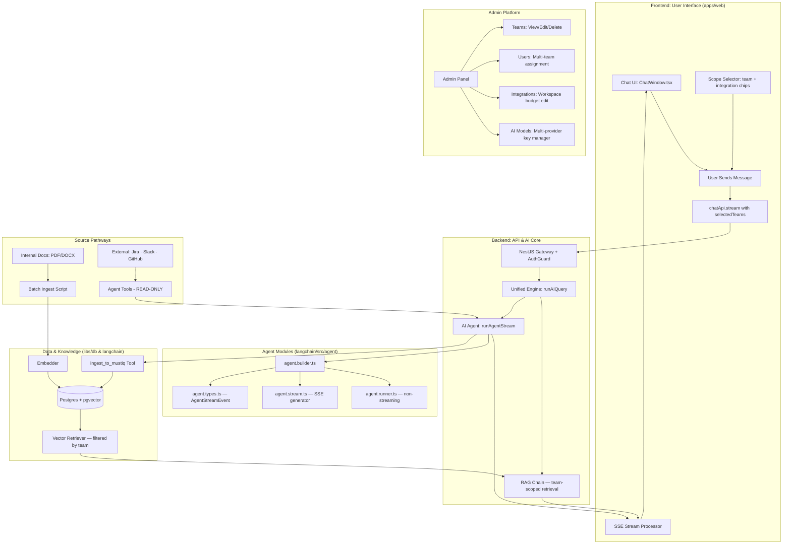

# Must-IQ: Full-Stack AI Flow

The interaction between the user interface, the backend, and the AI ingestion process follows a structured **RAG (Retrieval-Augmented Generation)** architecture. This ensures a seamless, streaming chat experience backed by internal company knowledge, scoped to the user's **assigned teams and their associated workspaces**. Jira workspaces are uniquely shareable across multiple teams.

## 🏗️ High-Level Architecture

---

## 🎨 Frontend Flow (Interacting)

1. **Team/Scope Selection**: The user picks which team's integration sources (🎫 Jira · 🐙 GitHub · 💬 Slack) to include in the search, using the sidebar **Scope Selector**. `General` is always locked ON.
2. **Submission**: User types a question in `InputBar.tsx` and hits send. The selected team IDs are included in the request payload.
3. **Streaming Request**: `chatApi.stream` initiates a `POST` to the backend with `stream: true` and `selectedTeams`.
4. **Real-time Processing**: As the backend generates tokens, the frontend reads the body stream using a `ReadableStreamDefaultReader`.
5. **UI Updates**:
   - `onChunk` → appends new text to the active message bubble.
   - `onSources` → displays clickable citations (Jira ticket / GitHub file / Slack thread / Doc).
   - `onTokenUsage` → updates the user's daily budget indicator.
1.  **Team/Scope Selection**: The user picks which team's integration sources (🎫 Jira · 🐙 GitHub · 💬 Slack) to include in the search, using the sidebar **Scope Selector**. `General` is always locked ON.
2.  **Submission**: User types a question in `InputBar.tsx` and hits send. The selected team IDs are included in the request payload.
3.  **Streaming Request**: `chatApi.stream` initiates a `POST` to the backend with `stream: true` and `selectedTeams`.
4.  **Real-time Processing**: As the backend generates tokens, the frontend reads the body stream using a `ReadableStreamDefaultReader`.
5.  **UI Updates**:
    - `onChunk` → appends new text to the active message bubble.
    - `onSources` → displays clickable citations (Jira ticket / GitHub file / Slack thread / Doc).
    - `onTokenUsage` → updates the user's daily budget indicator.
    - `onToolCall` → shows a typing indicator with the tool being used (🔍 / 🧠 / 💾).

---

## 🗄️ Ingestion & Knowledge Acquisition

### ⚡ Mode A: Static & Manual Ingestion (Admin UI)

Used for structured, stable documents or legacy codebase imports.

1.  **Document Upload:** Admins/Managers upload files (PDF, DOCX, etc.) via the Admin UI. Chunks are tagged with a specific **Team** or the **General** workspace.
2.  **Manual Repo ZIP Upload:** Entire repositories can be ingested by uploading a `.zip` file. The backend (using `adm-zip`) extracts and recursively processes supported code files for vectorization.
3.  **Persistence:** Chunks are saved in the `document_chunks` table, with high-precision metadata for team-scoped retrieval.

### 🤖 Mode B: Agentic On-Demand Ingestion (Jira · Slack · GitHub)

Used for dynamic, ever-changing knowledge. This supports both **Agent-led** and **Admin-triggered** pulls.

1.  **Agent-led Discovery**: When the RAG chain lacks an answer, the **AI Agent** actively uses tools (`search_jira`, etc.) to pull context in real-time and persists it via `ingest_to_mustiq`.
2.  **Admin-Triggered Sync (On-Demand)**: From the Admin UI, admins can trigger a "Targeted Sync" for a specific Team. This pulls current data from all (or specific) workspaces associated with that team.
3.  **Persistence**: Data is summarized, embedded, and stored, allowing Must-IQ to learn from recent activity across all integrated platforms.

> [!IMPORTANT]
> **Why Pull instead of Push?**
> - **Cost & Noise**: We only ingest relevant data, avoiding the high cost of embedding every single message or commit across the company.

---

## 🔍 Backend Retrieval Flow

2. **Vectorization**: The question is converted to a vector using the active embedding model.
3. **Team-Scoped Search**: PostgreSQL finds the closest matches in `document_chunks`, **filtered to the user's selected team workspaces only**.
4. **Prompt Augmentation**: Top-K chunks are injected as "Context" into the LLM system prompt.
5. **Generation**: The active LLM (driven by `settings.service.ts`) writes a response grounded in that context.

---

## 🔐 Key Integration Points

| Component | Responsibility | Location |
|---|---|---|
| **LangChain Lib** | Core RAG, Agent, and tool logic | `langchain/src/` |
| **Agent Builder** | Wires LLM + tools + prompt | `langchain/src/agent/agent.builder.ts` |
| **Agent Stream** | SSE `AsyncGenerator` for frontend | `langchain/src/agent/agent.stream.ts` |
| **AI Core** | Orchestrates the RAG flow; manages memory | `langchain/src/services/` |
| **API Gateway** | Auth, token budgets, routing | `apps/api/` |
| **Settings Service** | LLM config + encrypted key management | `libs/config/src/settings.service.ts` |
| **PostgreSQL** | Relational data (Users/Teams/Sessions) + pgvector | `libs/db/` |

---

## 🏷️ Team Model

Each **Team** consists of:
- A name (e.g., "API Infrastructure")
- Assigned integration sources: Jira · GitHub · Slack.
- **Shared Jira**: A single Jira workspace can be associated with multiple teams.
- **Unique Slack/GitHub**: Slack and GitHub sources are uniquely mapped 1:1 to a team.
- A set of assigned users.

The `General` workspace is shared across all users and always included in search.

**Admins** automatically have access to all teams' data. All other users only see chunks tagged to their assigned teams.
