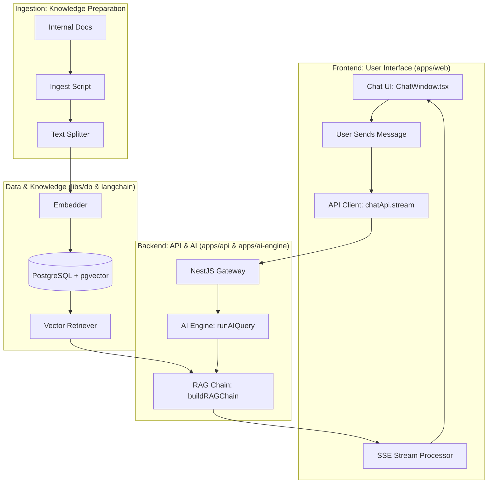

# Must-IQ: Full-Stack AI Flow

The interaction between the user interface, the backend, and the AI ingestion process follows a structured **RAG (Retrieval-Augmented Generation)** architecture. This ensures a seamless, streaming chat experience backed by internal company knowledge.

## 🏗️ High-Level Architecture

---

## 🎨 Frontend Flow (Interacting)
This is how the user experiences the AI in the browser.

1.  **Submission**: User types a question in [InputBar.tsx](file:///Users/odeyemiibukunajewole/Documents/Must-Project/leader-ship-training/must-iq/apps/web/src/components/chat/InputBar.tsx) and hits send.
2.  **Streaming Request**: The `chatApi.stream` (in `libs/api/chat.ts`) initiates a `POST` request to the backend with `stream: true`. 
    - *Note: We use native `fetch` because Axios does not natively support browser-side streaming for this format.*
3.  **Real-time Processing**: As the backend generates tokens, the frontend reads the body stream using a `ReadableStreamDefaultReader`.
4.  **UI Updates**: 
    - `onChunk`: Appends new text to the active message bubble in [ChatWindow.tsx](file:///Users/odeyemiibukunajewole/Documents/Must-Project/leader-ship-training/must-iq/apps/web/src/components/chat/ChatWindow.tsx).
    - `onSources`: Displays clickable citations (Jira, Slack, Docs) once the retrieval is complete.
    - `onTokenUsage`: Updates the user's daily budget indicator.

---

## 📥 Ingestion Flow (Preparation)
This phase is responsible for converting unstructured data into a searchable "vector" format.

1.  **Selection**: A file (e.g., `hr-policy.pdf`) is selected for ingestion with a specific department tag.
2.  **Loading**: The system uses specialized LangChain loaders (found in [langchain/src/rag/ingest.ts](file:///Users/odeyemiibukunajewole/Documents/Must-Project/leader-ship-training/must-iq/langchain/src/rag/ingest.ts)) to extract text.
3.  **Splitting**: Large documents are broken into smaller **chunks** (e.g., 500 characters) to ensure they fit within LLM context limits and provide more precise search results.
4.  **Embedding**: Each chunk is passed through an Embedding model (like OpenAI's `text-embedding-3-small`). This turns text into a high-dimensional list of numbers (a vector).
5.  **Storage**: The chunk, its vector, and metadata (Source Name, Department) are saved into the `document_chunks` table in PostgreSQL using the `pgvector` extension.

---

## 🔍 Phase 2: Backend Retrieval Flow
This phase happens every time a user asks a question in the chat.

1.  **Query Trigger**: The user sends a message via the Web App to [apps/api/src/chat/chat.service.ts](file:///Users/odeyemiibukunajewole/Documents/Must-Project/leader-ship-training/must-iq/apps/api/src/chat/chat.service.ts).
2.  **Vectorization**: The backend (via the AI Engine) converts the user's question into a vector using the same embedding model used during ingestion.
3.  **Similarity Search**: PostgreSQL calculates the "distance" between the user's question vector and all the stored document chunk vectors. It filters these results by the user's selected **Workspaces** (within their assigned **Teams**) to ensure they only see what they are allowed to.
4.  **Prompt Augmentation**: The top-K most relevant text chunks are retrieved and injected into the system prompt as "Context".
5.  **LLM Generation**: The LLM receives the system prompt + context + user question and generates an answer derived *only* from the provided context (if configured to do so).

---

## 🔐 Key Integration Points

| Component | Responsibility | Location |
| :--- | :--- | :--- |
| **LangChain Lib** | Core logic for splitting, loading, and RAG logic. | `langchain/src/` |
| **AI Engine** | Orchestrates the RAG flow and manages AI memory. | `apps/ai-engine/` |
| **API Gateway** | Handles Auth, permissions, and routes chat requests. | `apps/api/` |
| **PostgreSQL** | Stores both relational data (Users/Sessions) and vectors. | `libs/db/` |
