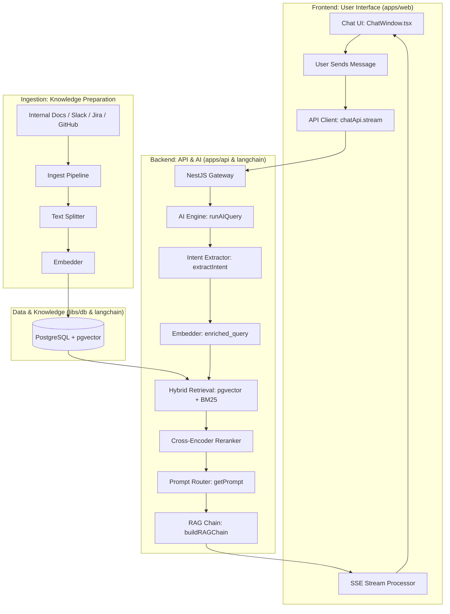

# Must-IQ: Full-Stack AI Flow

The interaction between the user interface, the backend, and the AI ingestion process follows a structured **RAG (Retrieval-Augmented Generation)** architecture. This ensures a seamless, streaming chat experience backed by internal company knowledge.

## High-Level Architecture



---

## Frontend Flow

1. **Submission**: User types a question and hits send.
2. **Streaming Request**: `chatApi.stream` initiates a `POST` to the backend with `stream: true`. Native `fetch` is used (not Axios) because it supports browser-side SSE streaming.
3. **Real-time Processing**: As the backend generates tokens, the frontend reads the body stream via `ReadableStreamDefaultReader`.
4. **UI Updates**:
   - `onChunk`: Appends new text to the active message bubble.
   - `onSources`: Displays clickable citations (Jira, Slack, Docs) once retrieval is complete.

---

## Backend Query Flow

This is the full pipeline that runs on every user message.

### Step 0 — Ticket-tag short-circuit

Before any LLM call, the query is checked for structured ticket tags: `[Requester]`, `[Department]`, `[Expected Result]`, `[Description]`, `[Due Date]`, `[Assigned to]`, `[Solution]`, `[High]`, `[Medium]`, `[Low]`.

If any tag is found:
- `domain` is forced to `operations`, `taskType` to `RETRIEVAL_QUERY`
- Intent extraction is **skipped** (no LLM cost)
- Prompt selection falls directly to `ENGINEERING_PROMPT` (8-section operational report)

### Step 1 — Intent Extraction

For all other queries (length > threshold, classification enabled), a **single fast LLM call** runs `extractIntent()` using `COMBINED_INTENT_PROMPT`.

Returns a structured `ExtractedIntent`:

```ts
{
  domain:         IntentDomain       // engineering | operations | hr | general
  issue_type:     IntentIssueType    // see table below
  resources:      string[]           // systems/modules mentioned (max 5)
  actors:         string[]           // people/teams involved (max 3)
  action:         string             // core verb phrase: "grant access", "fix bug"
  enriched_query: string             // technical rewrite of the raw query
}
```

**Domains (4):**

| Domain | Covers |
|---|---|
| `engineering` | Code, bugs, features, architecture, CI/CD, deployments |
| `operations` | Permissions, account reset, data export, refund, revoke, bulk update, helpdesk, VPN, password reset, device setup |
| `hr` | Leave, payroll, benefits, recruitment, onboarding, performance review |
| `general` | Company policy, general knowledge |

> `it` was removed as a domain. IT helpdesk queries (password reset, VPN, device setup) are now classified under `operations` — the `issue_type` field drives the correct response format.

**Issue Types (10):**

| `issue_type` | When used |
|---|---|
| `permission_request` | Granting/managing system access |
| `bug` | Code defect to investigate and fix |
| `incident` | Production outage or service down (higher urgency than bug) |
| `how_to` | Procedural questions: steps to do something |
| `status_check` | Verify current state of a transaction/user/system |
| `data_request` | Fetch or export data |
| `feature_request` | New functionality to build |
| `approval_request` | Needs human sign-off (leave, deploy gate, budget) |
| `policy_lookup` | What is the rule/policy for X |
| `other` | Catch-all fallback |

### Step 2 — Query Enrichment

The `enriched_query` from intent extraction is used for all downstream search — not the raw user query.

Example:
```
raw:      "CS team needs inquiry access"
enriched: "grant CS team inquiry.show inquiry.create permissions MSQ Admin
           platform users roleValidationMiddleware permissionKeys"
```

This closes the vocabulary gap between casual language and stored code/doc terminology.

### Step 3 — Embedding & Hybrid Retrieval

- `taskType` is set from the domain (`engineering` → `CODE_RETRIEVAL_QUERY`, all others → `RETRIEVAL_QUERY`)
- The enriched query is embedded
- **Dense search** (pgvector cosine) and **sparse search** (BM25) run in parallel
- Results merged via Reciprocal Rank Fusion (RRF, K=60), topK=60
- Optional **HyDE**: a hypothetical answer document is generated and embedded instead, for harder queries

### Step 4 — Reranking

A local cross-encoder (`ms-marco-MiniLM-L-6-v2`, ONNX) scores all 60 candidates and narrows to the top 20 by relevance. Chunks below `MIN_SCORE=0.1` are filtered. Duplicates removed. Token budget capped at 6000.

### Step 5 — Prompt Selection

`buildRAGChain` selects the response format using a two-signal router:

```
getPrompt(issueType, domain)
```

**`issue_type` is the primary signal. `domain` only breaks ties for `how_to` and `policy_lookup`.**

| `issue_type` | `domain` | Prompt |
|---|---|---|
| `bug`, `incident`, `feature_request` | any | `ENGINEERING_PROMPT` |
| `permission_request`, `approval_request` | any | `ENGINEERING_PROMPT` |
| `status_check`, `data_request` | any | `ENGINEERING_PROMPT` |
| `how_to` | `hr` | `HR_PROMPT` |
| `how_to` | `engineering` | `ENGINEERING_PROMPT` |
| `how_to` | `operations` / `general` | `IT_PROMPT` |
| `policy_lookup` | `hr` | `HR_PROMPT` |
| `policy_lookup` | other | `RAG_PROMPT` |
| `other` | any | `RAG_PROMPT` |

**Ticket-tag path** (no intent extraction): `getPromptForWorkspace("operations")` → always `ENGINEERING_PROMPT`.

**Tools path** (agent, no intent extraction): `getPromptForWorkspace(workspaceName)` — keyword-based fallback, unchanged.

**Prompt formats:**

| Prompt | Tone & Format |
|---|---|
| `ENGINEERING_PROMPT` | Structured 8-section report (Executive Summary, Root Cause, Fix, Impact, Test Scenarios). Also handles Operational/Admin requests. |
| `IT_PROMPT` | Step-by-step helpdesk format: Troubleshooting / Setup / Access / Inquiry |
| `HR_PROMPT` | Empathetic, policy-aware prose |
| `RAG_PROMPT` | General-purpose conversational answer |

### Step 6 — LLM Generation & Response

- The enriched query is sent to the main LLM (not the raw query)
- Response is streamed via SSE (web) or returned as JSON (integrations)
- Message and token usage persisted to PostgreSQL (non-blocking)

---

## Ingestion Flow

Ingestion is pull-based via cron jobs running at 06:00 and 18:00 daily (last 12 hours of data):

- **Slack**: Lists all bot-member channels → maps to workspaces → `pullSlackData`
- **GitHub**: Queries `Workspace` table for `type=GITHUB` → `pullRepoPRs` per repo
- **Jira**: Queries `Workspace` table for `type=JIRA` → `pullJiraIssues` per project

All three toggles (`slackIngestionEnabled`, `repoIngestionEnabled`, `jiraIngestionEnabled`) are controllable from Admin UI → System Settings.

The Slack `app_mention` webhook (`POST /webhooks/slack`) is separate from ingestion — it handles the interactive **@must-iq → Jira card** flow.

---

## Key Integration Points

| Component | Responsibility | Location |
|---|---|---|
| **Intent Extractor** | Fast LLM call producing domain, issue_type, enriched_query | `langchain/src/intent/intent-extractor.ts` |
| **Classifier Prompt** | Few-shot prompt driving intent extraction | `langchain/src/prompts/must-iq-classifier.prompt.ts` |
| **Prompt Router** | `getPrompt(issueType, domain)` — issue_type-first selection | `langchain/src/prompts/must-iq-rag.prompt.ts` |
| **RAG Chain** | Assembles prompt + LLM + output parser | `langchain/src/chains/rag-chain.ts` |
| **AI Engine** | Orchestrates the full query pipeline | `langchain/src/service/ai-engine.service.ts` |
| **API Gateway** | Auth, permissions, routes chat requests | `apps/api/src/chat/` |
| **PostgreSQL** | Relational data + pgvector embeddings | `libs/db/` |
