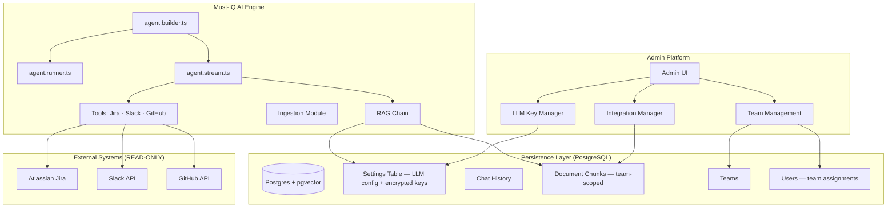

# Must-IQ AI Engine — Solution Design
## Orchestration with LangChain + LangGraph

**Document Type:** Solution Design  
**Version:** 1.5  
**Last Updated:** March 2026  
**Scope:** AI Engine — Core Orchestration & Admin Platform Layer

---

## 1. Executive Summary

Must-IQ uses **LangChain** and **LangGraph** to provide a provider-agnostic, scalable, and secure internal AI assistant. By leveraging the **LCEL (LangChain Expression Language)** and a settings-driven approach, we maintain a modular codebase where switching between LLM providers, changing the retrieval strategy, or managing API key rotation requires only an Admin UI interaction — no code deployment.

Key capabilities added in v1.4:
- **Multi-team user model** — users belong to one or more teams. Teams and Workspaces share a many-to-many relationship (Jira projects can be shared across teams; Slack/GitHub remain 1:1).
- **Multi-provider API key management** — multiple encrypted keys per provider, single-active global rule
- **Agent file decomposition** — the monolithic agent file split into focused, independently testable modules
- **Scope-aware chat search** — users control which team's data sources are searched in real-time
- **Workspace identifier consolidation** — Workspace model now uses a single `identifier` field (replaces separate `jiraProject`, `slackChannel`, `githubRepo` columns)
- **Conversational chain migration** — `ConversationChain` (removed in LangChain v0.3) replaced with `RunnableWithMessageHistory` using the LCEL pipeline pattern
- **Admin UI Document Ingestion** — Drag-and-drop file upload for PDF/DOCX/TXT/MD with real-time logging to `IngestionEvent`

---

## 2. Core Concepts: LCEL

The modern LangChain approach uses the pipe operator `|` to compose "Runnables" into a clean pipeline:

```typescript
const ragChain = retriever          // Step 1: Search context (team-scoped)
  | formatDocs                      // Step 2: Clean text
  | prompt                          // Step 3: Inject context into template
  | llm                             // Step 4: Call the active provider
  | new StringOutputParser();       // Step 5: Return clean string
```

---

## 3. Architecture Overview



---

## 4. Component Details

### 4.1 Vector Storage (PostgreSQL + pgvector)
Instead of a dedicated vector database, we use the existing PostgreSQL instance with `pgvector`. This keeps relational data (metadata, team ownership) and embeddings co-located.

- **Storage**: `PGVectorStore` from LangChain.
- **Embeddings**: Settings-driven (default: `text-embedding-3-small`).
- **Retriever**: Team-scoped similarity search — every query is filtered to the requesting user's selected team workspaces.

### 4.2 The AI Agent (LangGraph) — Split Architecture

The agent is now decomposed into four focused files for clarity and independent testability:

| File | Responsibility |
|---|---|
| `agent.builder.ts` | `buildMustIQAgent()` — wires LLM + tools + prompt |
| `agent.runner.ts` | `runAgent()` — single-turn, returns string (for jobs/CLI) |
| `agent.stream.ts` | `runAgentStream()` — `AsyncGenerator<AgentStreamEvent>` for SSE |
| `agent.types.ts` | `AgentStreamEvent` discriminated union |
| `index.ts` | Barrel re-export — single import surface |

The original `must-iq-agent.ts` has been deleted in favor of the decomposed architecture.

### 4.3 Centralized Prompts
All system prompts are in versioned files under `langchain/src/prompts/`. The agent builder injects the active provider/model and selected workspaces into the prompt at runtime.

### 4.4 LLM Provider Management
The `settings.service.ts` (`@must-iq/config`) reads the active LLM configuration from the `settings` DB table:

- Multiple API keys per provider (Anthropic, OpenAI, Gemini, xAI Grok, Ollama)
- Single-active global rule — only one key is `isActive: true` across all providers at any time
- Keys are AES-encrypted at rest; the service includes a `tryDecrypt` fallback that gracefully handles plain-text keys (e.g., from seed data)
- 60-second in-memory cache to avoid per-request DB hits

### 4.5 Team Scopes & Search
The chat sidebar provides a **Search Scope** selector showing the user's available teams. Each team row expands to show its integration source chips (🎫 Jira · 🐙 GitHub · 💬 Slack). Users see all workspaces associated with their teams, including shared Jira projects. The `General` scope is always locked ON.

---

## 5. Security & Isolation

1. **Team-Scoped Retrieval**: Every RAG query is hard-filtered to the requesting user's selected team workspaces — users can never retrieve content from teams they don't belong to.
2. **Read-Only Integrations**: Tools for Jira, Slack, and GitHub are strictly READ-ONLY. The agent can never post messages or modify tickets.
3. **Encrypted API Keys**: Provider API keys are AES-encrypted before being stored in the `settings` table. Decryption happens in-memory server-side only.
4. **Token Budgets**: Every request is gated by a per-user token budget (stored in the `users` table, enforced by the API gateway).
5. **Admin-Only Settings**: The `PUT /api/v1/settings/llm` endpoint is guarded by ADMIN role check.

---

## 6. Admin Panel Capabilities

| Section | Features |
|---|---|
| **Teams** | View, rename, delete teams; see integration sources (identifiers) per team |
| **Users** | Multi-team assignment via modal; admin auto-gets all teams; team badge display |
| **Integrations** | Add/edit/delete Workspace sources; single `identifier` field per source (channel ID, repo name, or project key); token budget per workspace |
| **AI Models** | Multi-key management per provider; activate/deactivate keys; add keys |
| **Knowledge Base** | Drag-and-drop file upload (managed ingestion); paginated event log/history |
| **System Settings** | Toggle RAG, caching, audit logging, rate limiting; live health panel |

### 🏷️ Supported Solution Layers
- **Core**: Frontend (React) & Backend (NestJS)
- **Blockchain**: Solidity Smart Contracts & Web3 Provider integration
- **Serverless**: Function-as-a-Service (AWS Lambda, Cloud Functions)
- **Automation**: Custom crawlers & web scrapers
- **Infrastructure**: IAC (Terraform, K8s)

---

## 7. Development & Testing

```bash
# Ingest context into a team's knowledge base (via API or ingestion script)
# Or use the specialized ingestion endpoint
curl -X POST http://localhost:4000/api/v1/ingestion/pull ...

# Run a streaming query via API
curl -X POST http://localhost:4000/api/v1/chat/stream ...
```

---

## 8. Comparison

| Feature | Legacy / Manual Flow | Must-IQ Architecture |
|---|---|---|
| **Pipeline** | Imperative Loops/Handlers | LCEL Chains (Declarative) |
| **Vector DB** | External Vector DB | Integrated Postgres + pgvector |
| **Providers** | Provider-specific SDKs | Unified Factory (Provider-Agnostic) |
| **Keys** | Single static env key | Multi-key, admin-managed, encrypted |
| **Scopes** | Single workspace per user | Multi-team, per-user, selectable at search time |
| **Agent** | Monolithic file | Split: builder · runner · stream · types |
| **Logic** | Hardcoded Prompts | Centralized Prompt Templates |
| **Memory** | Manual JSON arrays | Automatic SQL/Redis Memory |
